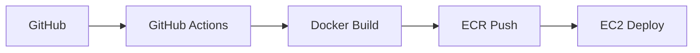

# 🐾 PETORY

<div align="center">


[](https://www.oracle.com/java/)
[](https://spring.io/projects/spring-boot)
[](https://www.mysql.com/)
[](https://redis.io/)
[](https://www.docker.com/)
[](https://aws.amazon.com/)

**반려동물과 함께하는 일상을 더욱 풍요롭게 만드는 웹 플랫폼**

[🌐 사이트 바로가기](https://petory.click/login.html) | [📖 API 문서](https://documenter.getpostman.com/view/43234443/2sB2xE9ndC) | [🎨 와이어프레임](https://embed.figma.com/design/VyKiRe0wVqK9vkuDqdkojg/Petory-%EC%A0%9C%EC%B6%9C%EC%9A%A9?node-id=0-1)

</div>

## 💡 프로젝트 소개

> **"하루 한 번, 반려동물과 더 가까워지는 웹"**

반려동물은 이제 단순한 '펫'이 아닌 '가족'입니다.

하지만 반려인들은 여전히 **정보 공유**, **소통**, **기록 관리**, **용품 거래** 등 일상 속 다양한 불편함을 겪고 있습니다.

PETORY는 이런 반려인들의 일상을 더 풍요롭게 만들기 위해 탄생한 **소통/거래/기록 통합 플랫폼**입니다.

### 🎯 해결하고자 하는 문제

- 💬 **소통 부족**: 반려인들끼리 경험을 나눌 수 있는 전용 공간이 부족
- ♻️ **거래 불편**: 반려용품 중고거래가 번거롭고 신뢰성 부족
- 🍽️ **정보 부족**: 반려동물 동반 가능한 장소 정보가 분산되어 있음
- 📸 **기록 관리**: 반려동물과의 소중한 순간들을 체계적으로 관리하기 어려움


    
## 🛠️ 기술 스택

### Backend


### Database


### DevOps & Infrastructure


### Frontend


### External APIs


## ✨ 핵심 기능

### 💬 반려인 커뮤니티
- **일상 공유**: 반려동물과의 소소한 일상을 자유롭게 공유
- **정보 교환**: 댓글을 통한 실용적인 정보 공유 및 소통
- **중고 거래**: 반려용품 중고거래와 실시간 채팅 기능

### ☕ 반려 플레이스
- **장소 탐색**: 반려동물 동반 가능한 식당, 카페, 숙소 정보
- **리뷰 시스템**: 사용자 리뷰 및 별점으로 신뢰성 있는 정보 제공
- **인기 장소**: 좋아요 기반 인기 플레이스 추천

### ✉️ 데일리 기록
- **데일리 앨범**: 하루 한 컷, 반려동물과의 추억 저장
- **데일리 QnA**: 매일 다른 질문에 답하며 일기 작성
- **성장 기록**: 1년 전 기록과 비교하며 반려동물의 성장 확인

### ⚙️ 추가 기능
- **권한 분리**: 비회원/회원/관리자 구분된 접근 제어
- **실시간 알림**: 스케줄러 기반 데일리 질문 알림
- **캘린더**: 반려동물 관련 일정 관리 및 D-day 알림


## 🏗️ 시스템 아키텍처

    


### 🔧 인프라 구성

| 서비스 | 사양 | 역할 |
|--------|------|------|
| **EC2** | t2.medium | 애플리케이션 서버 |
| **RDS** | t4g.micro (MySQL) | 관계형 데이터베이스 |
| **ElastiCache** | t2.micro (Redis OSS) | 캐싱 및 세션 관리 |
| **ECR** | Private Repository | 컨테이너 이미지 저장 |
| **S3** | Standard | 사용자 업로드 파일 관리 |
| **MongoDB Atlas** | - | 채팅 데이터 저장 |

### 🚀 CI/CD 파이프라인



## 📊 성능 개선

### 🚀 Spring Batch 도입으로 91% 성능 개선

**문제상황**: 10만 명 사용자 대상 데일리 질문 알림 발송 시 58초 소요

**해결과정**:
1. **기존 방식** (findAll + for loop): 58초
2. **Spring Batch + 비동기 처리**: 8초 (86% 개선)
3. **JdbcCursorItemReader 적용**: 5초 (91% 개선)

```java
// 최종 적용된 배치 처리 구조
@Bean
public Step sendDailyQuestionStep(
    JobRepository jobRepository,
    PlatformTransactionManager transactionManager,
    JdbcCursorItemReader<User> userReader,
    ItemProcessor<User, Notification> itemProcessor,
    JdbcBatchItemWriter<Notification> itemWriter,
    TaskExecutor notificationTaskExecutor
) {
    return new StepBuilder("sendDailyQuestionStep", jobRepository)
        .<User, Notification>chunk(CHUNK_SIZE, transactionManager)
        .reader(userReader)
        .processor(itemProcessor)
        .writer(itemWriter)
        .taskExecutor(notificationTaskExecutor)
        .build();
}
```

## 🔐 주요 기술적 의사결정

### 1. QueryDSL 도입
- **배경**: 복잡한 동적 쿼리와 타입 안정성 확보 필요
- **장점**: 컴파일 시점 오류 확인, 유지보수성 향상, 동적 쿼리 작성 용이
- **결과**: 코드 안정성 향상 및 개발 효율성 증대

### 2. Redis 활용 전략
- **JWT 토큰 관리**: 로그아웃 시 블랙리스트 처리로 보안 강화
- **전역 캐시**: 데일리 질문 API 응답 속도 향상
- **Rate Limiting**: Bucket4j와 연동하여 API 요청 제한

### 3. Spring Batch 성능 최적화
- **청크 기반 처리**: 대용량 데이터를 효율적으로 처리
- **멀티스레드 활용**: TaskExecutor를 통한 병렬 처리
- **JDBC vs JPA**: 단순 삽입 작업에서 JDBC 선택으로 성능 향상

### 4. 보안 강화
- **Google OAuth2 + 자체 JWT**: 외부 인증 + 내부 인가 구조
- **토큰 분리**: AccessToken(짧은 수명) + RefreshToken(Redis 저장)
- **블랙리스트 처리**: 로그아웃된 토큰의 즉시 무효화

## 📈 모니터링

### Grafana + Prometheus 모니터링 시스템
- **시스템 메트릭**: CPU, 메모리, 네트워크 사용량 실시간 모니터링
- **애플리케이션 메트릭**: HTTP 응답 시간, DB 지연 시간 추적
- **알림 시스템**: 임계치 초과 시 Slack 알림 발송

## 🚨 주요 트러블슈팅

<details>
<summary><strong>1. Docker 빌드 캐시 이슈</strong></summary>

- **문제**: 코드 수정 후 배포했으나 변경사항이 반영되지 않음<br/>
- **원인**: Docker 레이어 캐시로 인해 소스코드 변경이 감지되지 않음<br/>
- **해결**: `--no-cache` 옵션 사용 및 빌드 단계 최적화

</details>

<details>
<summary><strong>2. JPA Lazy Loading으로 인한 401 에러</strong></summary>

- **문제**: Security 설정에 문제없음에도 401 Unauthorized 발생<br/>
- **원인**: LazyInitializationException이 Security Filter에서 401로 변환됨<br/>
- **해결**: QueryDSL fetch join 적용 및 GlobalExceptionHandler 보강<br/>

</details>

<details>
<summary><strong>3. Rate Limiting 버킷 초기화 문제</strong></summary>

- **문제**: Bucket4j Rate Limiting이 매 요청마다 초기화됨<br/>
- **원인**: BucketConfiguration이 매번 새로 생성됨<br/>
- **해결**: 필드 레벨에서 고정된 Configuration 사용

</details>

## 📱 주요 화면 (추가 예정)

| 메인 페이지 | 커뮤니티 | 플레이스 |
|-------------|----------|----------|
|  |  |  |

| 데일리 QnA | 채팅 | 캘린더 |
|-------------|------|--------|
|  |  |  |

## 🗂️ 프로젝트 구조

```
📦 petory
├── 📂 src/main/java/com/study/petory
│   ├── 📂 common                  # 공통 유틸리티 및 설정
│   │   ├── 📂 config              # 설정 클래스들
│   │   ├── 📂 entity              # 공용 엔티티
│   │   ├── 📂 exception           # 예외 처리
│   │   ├── 📂 filter              # 필터
│   │   ├── 📂 response            # 공통 응답
│   │   ├── 📂 scheduler           # 스케쥴러
│   │   ├── 📂 security            # 보안 설정
│   │   ├── 📂 service             # 공용 서비스
│   │   └── 📂 util                # 유틸리티 클래스
│   ├── 📂 domain
│   │   ├── 📂 user                # 사용자 관리
│   │   ├── 📂 ownerBoard          # 커뮤니티 게시판
│   │   ├── 📂 place               # 플레이스 관리
│   │   ├── 📂 chat                # 채팅 기능
│   │   ├── 📂 calendar            # 캘린더 기능
│   │   ├── 📂 daily               # 데일리 기능
│   │   └── 📂 notification        # 알림 기능
│   └── 📂 batch                   # 배치 작업
├── 📂 src/main/resources
│   ├── 📂 static                  # 정적 리소스
│   ├── 📂 templates               # Thymeleaf 템플릿
│   └── 📄 application.properties  # 애플리케이션 설정
├── 📄 docker-compose.yml    
└── 📄 Dockerfile
```

## 🚀 로컬 개발 환경 설정

### 1. 필수 요구사항
- Java 17+
- Docker & Docker Compose
- Git

### 2. 클론 및 실행
```bash
# 프로젝트 클론
git clone https://github.com/jhyang22/Petory.git
cd petory

# Docker Compose로 개발 환경 실행
docker-compose up -d

# 애플리케이션 빌드 및 실행
./gradlew bootRun
```

### 3. 접속 정보
- **애플리케이션**: http://localhost:8080
- **Grafana**: http://localhost:3000 (admin/admin)
- **MySQL**: localhost:3306
- **Redis**: localhost:6379

## 📝 API 문서

자세한 API 문서는 [Postman Documentation](https://documenter.getpostman.com/view/43234443/2sB2xE9ndC)에서 확인하실 수 있습니다.

### 주요 API 엔드포인트

| 기능 | Method | Endpoint | 설명 |
|------|--------|----------|------|
| 로그인 | GET | `/oauth2/authorization/google` | Google OAuth2 로그인 |
| 게시글 목록 | GET | `/owner-boards` | 커뮤니티 게시글 조회 |
| 게시글 작성 | POST | `/owner-boards` | 새 게시글 작성 |
| 플레이스 검색 | GET | `/places` | 반려동물 동반 장소 검색 |
| 채팅방 입장 | GET | `/chat/rooms/{roomId}` | 채팅방 입장 |
| 데일리 질문 | GET | `/daily/questions/today` | 오늘의 질문 조회 |

## 👥 팀원 소개

| 역할 | 이름  | 담당 기능                                                          | GitHub                              |
|------|-----|----------------------------------------------------------------|-------------------------------------|
| **BE 개발자** | 양재호 | 팀장, Place 도메인, KaKaoMap API 연동, Rate Limiting 기능               | [  🐹](https://github.com/jhyang22) |
| **BE 개발자** | 김하정 | 부팀장, 인증/보안, 비회원/회원 기준 인가, 회원세부 권한 기준 인가, 유저 정보 관리 자동화, Pet 도메인 | [  😺](https://github.com/mueiso)    |
| **BE 개발자** | 김채원 | TradeBoard 도메인, 채팅 기능, 데일리 질문 알림 기능 구현 및 최적화                   | [  🐰](https://github.com/chaewon9999)     |
| **BE 개발자** | 심재민 | DailyQnQ 도메인, Album 도메인, Google Calendar API 연동                | [  🦊](https://github.com/Deabaind)      |
| **BE 개발자** | 이은지 | OwnerBoard 도메인, AWS 인프라 구축, CI/CD                              | [  🦦](https://github.com/222eunji)   |

## 🏆 향후 개선 계획

### 🔐 보안 강화
- [ ] Parameter Store를 통한 환경변수 중앙 관리
- [ ] Private Subnet으로 EC2 이동 및 NAT Gateway 구성

### 📈 확장성 개선
- [ ] Auto Scaling Group 적용
- [ ] Application Load Balancer 도입

### 🚀 성능 최적화
- [ ] Spring Batch 파티셔닝 적용

---

<div align="center">


**🐾 PETORY와 함께 반려동물과의 소중한 순간을 기록하세요! 🐾**

Made with ❤️ by PETORY Team
</div>
